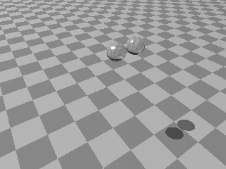
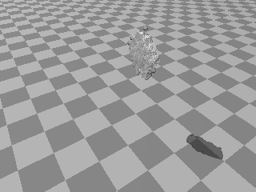
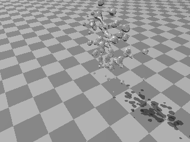

# Make collision movie using POV-Ray

## Summary
Make a movie (animation GIF) of droplets collision from
textdata using POV-Ray.

Following softwares are necessary.

- POV-Ray
- Ruby
- convert (ImageMagick)

## Usage:

```
$ tar xvzf conf.tar.gz
$ make
```

It will give you png files. If ImageMagick is installed, an animation gif will be also generated.

Here are the samples of pictures.





